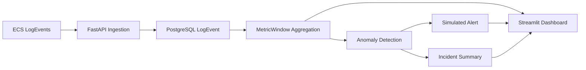

# Observability Watchdog — Architecture

## Overview

Observability Watchdog is a local, API-first SRE observability MVP. It ingests ECS-compatible JSONL logs, stores normalized events in PostgreSQL, aggregates fixed time-window metrics, detects explainable anomalies, creates simulated alerts, optionally enriches incidents with LLM summaries, and exposes everything through REST APIs consumed by a Streamlit dashboard.

The system is designed for a hiring-challenge scope: realistic architecture, clear trade-offs, no paid cloud dependencies, and human-reviewable anomaly decisions.

---

## System Boundaries

```text
┌─────────────────────────────────────────────────────────────────┐
│                     Local Developer Machine                     │
│                                                                   │
│  ┌──────────────┐    REST     ┌──────────────────────────────┐  │
│  │  Streamlit   │────────────>│  FastAPI (app/)              │  │
│  │  Dashboard   │             │  - ingestion APIs            │  │
│  └──────────────┘             │  - dashboard APIs            │  │
│                               │  - alert/incident APIs       │  │
│                               │  - BackgroundTasks worker    │  │
│                               └──────────────┬───────────────┘  │
│                                              │ SQL               │
│                               ┌──────────────▼───────────────┐  │
│                               │  PostgreSQL (Docker Compose) │  │
│                               └──────────────────────────────┘  │
└─────────────────────────────────────────────────────────────────┘
```

**External dependencies (optional):** Gemini or OpenAI APIs for incident summary enrichment only.

**Not included:** Celery, Redis, Kafka, cloud databases, real webhook delivery.

---

## High-Level Data Flow



### Pipeline stages

| Stage | Input | Output | Service |
|---|---|---|---|
| Parse & validate | Raw JSONL line | `ParsedLogEvent` or rejection | `EcsParser` |
| Dedupe & persist | Parsed events | `LogEvent` rows | `LogIngestionService` |
| Aggregate | Raw log events | `MetricWindow` rows | `MetricsAggregator` |
| Detect | Metric windows | `Anomaly` rows | `AnomalyDetectionService` |
| Enrich | Anomalies | Summary fields on anomaly | `IncidentSummaryService` |
| Alert | Enriched anomalies | `Alert` rows | `AlertService` |
| Visualize | All layers | Charts, tables, scores | Streamlit + dashboard APIs |

---

## Request Lifecycle

### Synchronous (request-time)

1. Client uploads JSONL or posts a JSON batch.
2. FastAPI validates the app exists.
3. Parser normalizes each ECS event.
4. Dedupe keys are generated and events inserted with `ON CONFLICT DO NOTHING`.
5. Ingestion run counters are updated; response returns `processing` or `completed`.
6. If new events were accepted, a background task is scheduled.

### Asynchronous (background post-processing)

Implemented in `process_ingestion_run()` via FastAPI `BackgroundTasks`:

1. Recompute affected 10-minute metric windows from **all** raw events
2. Load full window set for affected bucket starts
3. Run baseline anomaly detection
4. Enrich anomalies with incident summaries (template or LLM)
5. Create idempotent simulated alerts
6. Mark ingestion run `completed` with anomaly/alert counts

Clients poll `GET /ingestion-runs/{run_id}` until completion.

---

## Component Architecture

```text
app/
├── api/           HTTP routers (apps, logs, alerts, dashboard)
├── schemas/       Pydantic request/response models
├── models/        SQLAlchemy ORM entities
├── repositories/  Data access (queries, upserts, deletes)
├── services/      Business logic
│   ├── ecs_parser.py
│   ├── dedupe_service.py
│   ├── log_ingestion_service.py
│   ├── metrics_aggregator.py
│   ├── anomaly_detection_service.py
│   ├── health_score_service.py
│   ├── incident_summary_service.py
│   ├── alert_service.py
│   └── background_processing_service.py
└── seeds/         Default anomaly rules

dashboard/
├── streamlit_app.py   UI (API client only, no direct DB access)
└── api_client.py      HTTP wrapper for FastAPI endpoints
```

Design pattern: **service-repository** with strict typing. API routes are thin; services orchestrate; repositories handle SQL.

---

## Database Schema

All primary keys are UUIDs (`UUIDPrimaryKeyMixin`). Timestamps are timezone-aware.

### Entity relationship overview

```text
App
 ├── IngestionRun
 │    └── LogEvent
 ├── LogEvent (also linked to IngestionRun)
 ├── MetricWindow (aggregated, no FK to LogEvent)
 ├── Anomaly
 │    └── Alert (1:1 via unique anomaly_id)
 └── AnomalyRule (optional app-specific overrides)

Global AnomalyRule (app_id = NULL) — seeded defaults
```

### Core tables

#### `apps`

Monitored application boundary (e.g. "E-commerce Platform").

| Column | Type | Notes |
|---|---|---|
| `id` | UUID PK | |
| `name` | VARCHAR(255) | Display name |
| `slug` | VARCHAR(255) UNIQUE | URL-safe identifier |
| `environment` | VARCHAR(100) | production/staging/development |

#### `ingestion_runs`

Tracks one upload or batch submission lifecycle.

| Column | Type | Notes |
|---|---|---|
| `id` | UUID PK | |
| `app_id` | UUID FK → apps | CASCADE delete |
| `status` | VARCHAR(50) | processing / completed / failed |
| `accepted_events` | INT | Inserted event count |
| `skipped_duplicates` | INT | Dedupe skips |
| `detected_anomalies` | INT | Set after background processing |
| `alerts_triggered` | INT | Set after background processing |

#### `log_events`

Normalized ECS events.

| Column | Type | Notes |
|---|---|---|
| `id` | UUID PK | |
| `app_id` | UUID FK → apps | Observability boundary |
| `ingestion_run_id` | UUID FK → ingestion_runs | Provenance |
| `dedupe_key` | VARCHAR(128) | SHA-256 hex |
| `timestamp` | TIMESTAMPTZ | ECS @timestamp (UTC) |
| `service_name` | VARCHAR(255) | From ECS service.name |
| `log_level` | VARCHAR(50) | From ECS log.level |
| `message` | TEXT | |
| `raw_event_json` | **JSONB** | Full original event |
| `http_status_code` | INT | Optional |
| `url_path` | TEXT | Optional |
| `error_type` | VARCHAR(255) | Optional |
| `event_duration_ns` | BIGINT | Optional (for p95 latency) |

**Indexes:**

| Index | Columns | Purpose |
|---|---|---|
| `uq_log_events_app_dedupe` | `(app_id, dedupe_key)` UNIQUE | Deduplication |
| `idx_log_events_app_timestamp` | `(app_id, timestamp)` | Time-range queries |
| `idx_log_events_app_service_timestamp` | `(app_id, service_name, timestamp)` | Service-scoped aggregation |
| `idx_log_events_app_level_timestamp` | `(app_id, log_level, timestamp)` | Error filtering |
| `idx_log_events_raw_json` | GIN on `raw_event_json` | JSONB search |

#### `metric_windows`

Pre-aggregated 10-minute buckets.

| Column | Type | Notes |
|---|---|---|
| `app_id` | UUID | Scoped to app |
| `service_name` | VARCHAR(255) | Aggregation dimension |
| `url_path` | TEXT | Aggregation dimension (nullable) |
| `window_start` | TIMESTAMPTZ | Bucket start (floored to 10 min) |
| `window_end` | TIMESTAMPTZ | Exclusive end |
| `window_minutes` | INT | Default 10 |
| `total_events` | INT | |
| `error_count` | INT | log.level = ERROR |
| `error_rate` | FLOAT | error_count / total_events |
| `http_5xx_count` | INT | status 500–599 |
| `http_5xx_rate` | FLOAT | http_5xx_count / total_events |
| `latency_p95_ms` | FLOAT | p95 of event.duration (ns → ms) |
| `most_common_error_type` | VARCHAR(255) | Mode of error.type |

**Indexes:**

| Index | Columns | Purpose |
|---|---|---|
| `uq_metric_windows_scope` | `(app_id, service_name, COALESCE(url_path,''), window_start, window_minutes)` UNIQUE | One row per scope+bucket |
| `idx_metric_windows_app_window` | `(app_id, window_start)` | Chart queries |
| `idx_metric_windows_app_service_window` | `(app_id, service_name, window_start)` | Service trends |

#### `anomaly_rules`

Configurable detection guardrails (global defaults + optional app overrides).

| Column | Type | Notes |
|---|---|---|
| `app_id` | UUID FK (nullable) | NULL = global rule |
| `metric_name` | VARCHAR(100) | error_count, http_5xx_rate, latency_p95 |
| `warning_multiplier` | FLOAT | Score threshold for WARNING |
| `critical_multiplier` | FLOAT | Score threshold for CRITICAL |
| `min_event_count` | INT | Volume suppression |
| `baseline_window_minutes` | INT | Default 60 |
| `enabled` | BOOLEAN | Disabled app rules fall back to global |

#### `anomalies`

Detected abnormal metric behavior.

| Column | Type | Notes |
|---|---|---|
| `severity` | VARCHAR(20) | WARNING / CRITICAL |
| `metric_name` | VARCHAR(100) | Which metric triggered |
| `observed_value` | FLOAT | Current window value |
| `baseline_value` | FLOAT | Historical average (floored to 1.0) |
| `anomaly_score` | FLOAT | observed / baseline |
| `reason` | TEXT | Human-readable explanation |
| `ai_summary` | TEXT | Optional LLM/template summary |
| `generation_source` | VARCHAR(255) | template / gemini / openai |

**Indexes:**

| Index | Columns | Purpose |
|---|---|---|
| `uq_anomalies_scope` | `(app_id, rule_id, service_name, COALESCE(url_path,''), window_start, metric_name)` UNIQUE | One anomaly per scope+metric+bucket |
| `idx_anomalies_app_window` | `(app_id, window_start)` | Dashboard listing |

#### `alerts`

Simulated webhook alerts (not delivered externally).

| Column | Type | Notes |
|---|---|---|
| `anomaly_id` | UUID FK UNIQUE | Idempotent 1:1 with anomaly |
| `severity` | VARCHAR(20) | Copied from anomaly |
| `delivery_status` | VARCHAR(50) | Always `simulated` |
| `webhook_payload` | **JSONB** | Structured alert payload |

---

## Deduplication Strategy

Implemented in `DedupeService`:

### Primary path: ECS `event.id`

When `event.id` is present:

```text
dedupe_key = SHA256("event_id:{app_id}:{event.id}")
```

- App-scoped: same event ID in different apps produces different keys.
- Message changes for the same event ID do not affect the key.

### Fallback path: canonical field hash

When `event.id` is absent, a canonical JSON payload is built from normalized fields (app_id, timestamp, service, level, message, endpoint, HTTP status, error type, trace IDs, etc.) and hashed with SHA-256.

### Database enforcement

```sql
INSERT ... ON CONFLICT (app_id, dedupe_key) DO NOTHING
```

Index: `uq_log_events_app_dedupe`.

---

## Anomaly Detection (Explainable Baselines)

The `AnomalyDetectionService` is isolated from ingestion and alerting. Detection is **deterministic and auditable**:

```text
anomaly_score = observed_value / baseline_value
```

Where:

- `baseline_value` = average of up to 6 prior 10-minute windows within the 60 minutes before `window_start`
- Zero or missing baseline floors to `1.0` (cold-start protection)
- Severity from configurable multipliers on the global or app-specific rule
- Low-volume windows suppressed by `min_event_count`
- Stale anomalies deleted when metrics return below thresholds

**LLMs are not involved in anomaly classification.**

---

## Relative Time Semantics

Health scores and baselines use **log-relative time**, not server wall-clock:

| Concept | Anchor |
|---|---|
| Anomaly baseline window | 60 minutes before `window_start` |
| Health score 24h window | 24 hours before `MAX(log_events.timestamp)` for the app |
| Metric bucket alignment | Floored to fixed 10-minute UTC buckets |

This ensures reproducible results when replaying historical sample datasets.

---

## Async Execution Model: BackgroundTasks vs Celery

### Why FastAPI BackgroundTasks

| Factor | BackgroundTasks | Celery + Redis |
|---|---|---|
| Setup complexity | None (built into FastAPI) | Requires broker, workers, monitoring |
| Local demo friction | Low — works out of the box | Higher — extra containers/processes |
| MVP ingestion volume | Sufficient for JSONL uploads | Overkill for challenge scope |
| Reviewer experience | `make api` + upload + poll | Requires worker process management |
| Failure visibility | Ingestion run status endpoint | Needs dead-letter/retry infrastructure |

### Trade-off acknowledged

BackgroundTasks run in-process after the HTTP response. They are not durable across process restarts and do not scale horizontally. For production at scale, the natural evolution is:

- Celery/RQ with Redis for durable task queues
- Kafka for streaming ingestion
- Separate worker containers

For this MVP, BackgroundTasks demonstrate the async pipeline pattern without operational overhead.

---

## LLM Integration Boundary

```text
AnomalyDetectionService  ──> deterministic rules (source of truth)
        │
        ▼
IncidentSummaryService   ──> optional LLM enrichment (downstream only)
        │
        ▼
AlertService             ──> simulated webhook from confirmed anomalies
```

Providers: `template` (default), `gemini`, `openai`. Template fallback ensures the project runs without any API key.

---

## Testing Architecture

- Dedicated test database: `watchdog_test`
- Safety guard: refuses to truncate DBs whose name does not contain `test`
- Per-test table truncation + anomaly rule reseeding
- 92+ pytest tests covering parser, dedupe, aggregation, detection, health score, API, and end-to-end integration

---

## Deployment Topology (Local Only)

```text
docker compose up --build
├── db (postgres:16-alpine)     port 5432
└── api (uvicorn)               port 8000

make dashboard (separate process)
└── streamlit                     port 8501
```

No cloud resources. No decommissioning required.
